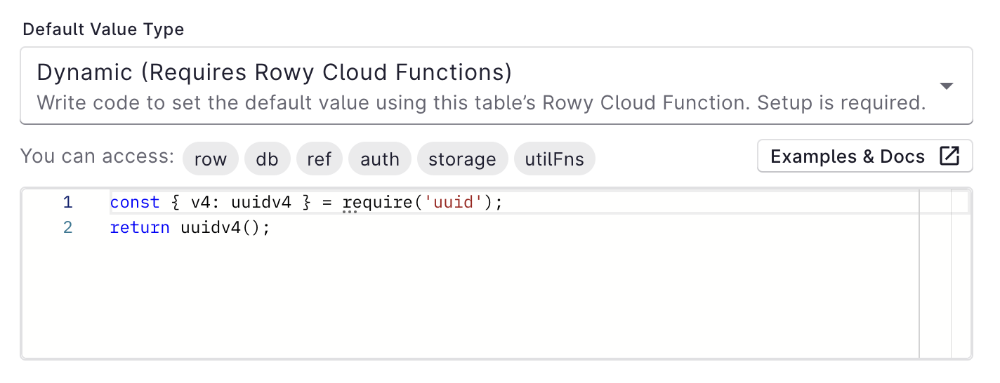

Default values can be set for any column and will be set whenever a new row is
created. Set default values in Column Settings.



<table><tbody><tr><td>

### Contents

- [Undefined](#undefined)
- [Null](#null)
- [Static](#static)
- [Dynamic](#dynamic)
  - [API](#api)
- [Examples](#examples)

</td></tr></tbody></table>

## Undefined

By default, the field’s value is `undefined`. This value is ignored by
Firestore, so the field won’t be set at all in the database.

## Null

Setting the default value as `null` makes it possible to filter rows by empty
fields.

## Static

Setting a static value will make all new rows have the same value for this field
by default.

## Dynamic

Setting a dynamic value lets you use JavaScript code to generate a default field
value.

### API

Your code has access to the following parameters and can use the
[`await` keyword](https://developer.mozilla.org/en-US/docs/Web/JavaScript/Reference/Operators/await).

You can also use npm packages using
[CommonJS `require` imports](https://nodejs.org/en/knowledge/getting-started/what-is-require/).

| Name      | Type                                                                                                                           | Description                                                                       |
| --------- | ------------------------------------------------------------------------------------------------------------------------------ | --------------------------------------------------------------------------------- |
| `row`     | [`Record<string, any>`](https://www.typescriptlang.org/docs/handbook/utility-types.html#recordkeystype)                        | All data in the current row.                                                      |
| `ref`     | [`firebase.firestore.DocumentReference`](https://firebase.google.com/docs/reference/node/firebase.firestore.DocumentReference) | Reference to the corresponding Firestore document of the current row.             |
| `db`      | [`firebase.firestore.Firestore`](https://firebase.google.com/docs/reference/node/firebase.firestore.Firestore)                 | Access to the full Cloud Firestore instance to access any collection or document. |
| `auth`    | [`admin.auth.Auth`](https://firebase.google.com/docs/reference/admin/node/admin.auth.Auth-1)                                   | Access to Firebase Auth via Admin SDK                                             |
| `storage` | [`admin.storage.Storage`](https://firebase.google.com/docs/reference/admin/node/admin.storage.Storage-1)                       | Access to Firebase Storage via Admin SDK                                          |
| `utilFns` |                                                                                                                                | TBD                                                                               |

## Examples

Use the row `ref` to get a value from the parent document.

```javascript
const parentDoc = await ref.parent.parent.get();
return parentDoc.get("email");
```

Use `db` to get any document in your database.

```javascript
const query = await db
  .collection("someCollection")
  .where("aField", "==", row.someKey)
  .get();
return query.docs[0].get("keyName");
```

Use an npm package to generate a UUID.

```js
const { v4: uuidv4 } = require("uuid");
return uuidv4();
```
